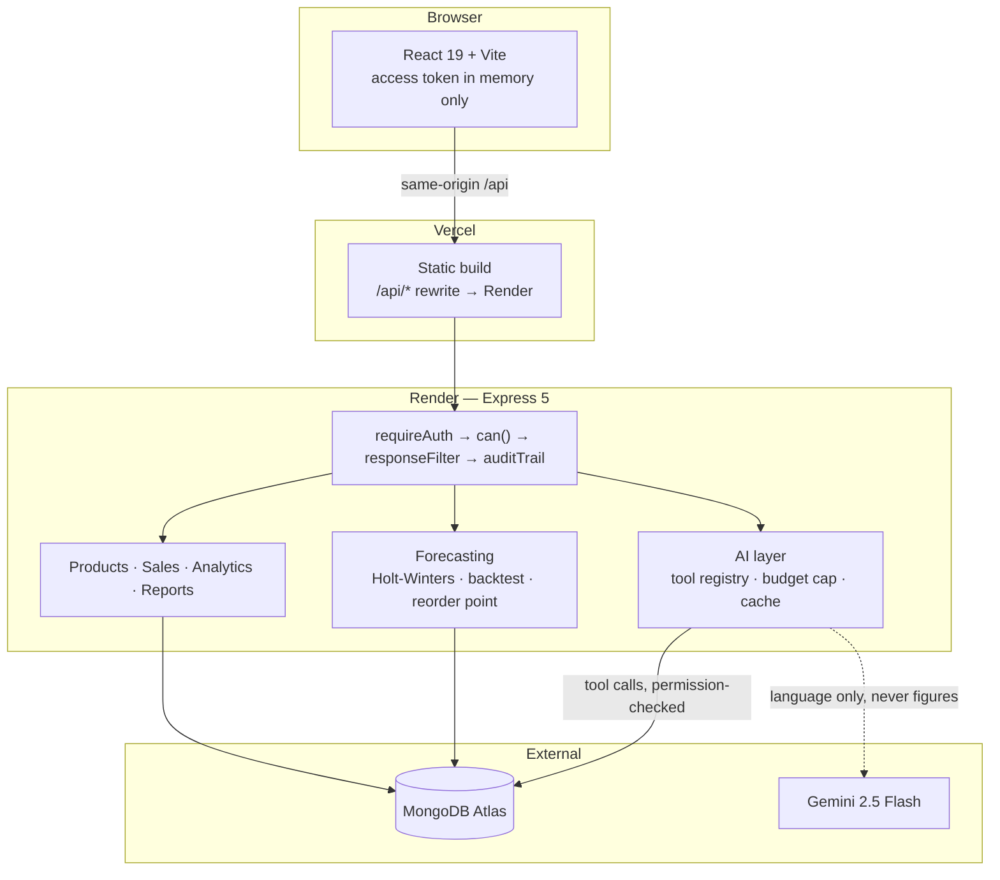

# Smart Inventory & Sales Management System

A stock and sales system for a small shop, with role-based access, demand
forecasting that publishes its own error rate, and an AI assistant bound by the
same permission table as the people using it.

**Live demo** → https://smart-inventory-and-sales-managemen-blue.vercel.app

| | |
|---|---|
| **Backend** | Node 20, Express 5, Mongoose 9, MongoDB Atlas — deployed on Render |
| **Frontend** | React 19, Vite, React Router 7, Recharts — deployed on Vercel |
| **AI** | Gemini 2.5 Flash (tool calling, structured output, vision) |
| **Testing** | Jest + Supertest, `mongodb-memory-server` |

---

## What it does

A shop owner tracks stock, records sales and purchases, and sees where the money
goes. An employee records sales and looks things up, and cannot see what
anything cost.

Beyond the CRUD, four things are worth a closer look:

**Demand forecasting that admits when it is wrong.** Holt-Winters with weekly
seasonality, but the method is chosen by the shape of the demand rather than
always reaching for the fanciest one: under 14 days of history it returns an
honest average instead of fitting a seasonal curve to noise, and a product that
sells on one day in five — a laptop, a television — goes to Croston's method
with the Syntetos-Boylan correction, because there is no weekly pattern in a
series that is mostly gaps. One-off bulk orders are capped before fitting, so a
school buying forty cables does not become next month's forecast. Accuracy is
measured by holding out the last 30 days and scoring against two free
baselines, and the app displays that figure, including when the baseline wins.

Intermittent products are scored on the total over the window rather than on
daily error, and the app says so. That is not a softer test: mean absolute
error is minimised by the median, which is zero when most days are zero, so on
daily error *no* forecast can beat predicting nothing — and a shop that follows
that forecast never reorders the laptop.

**Reorder points from inventory theory, not a rule of thumb.**
`reorder point = μ·L + z·σ·√L` — lead-time demand plus a buffer sized to how
*variable* demand is. A volatile product gets a bigger buffer than a steady one
selling the same volume, which a "keep 30 days of stock" heuristic cannot express.

**An assistant that can be refused.** Ask "which products made the most profit
last month?" in plain English. The model picks from 12 read-only tools and fills
in typed parameters; the server executes them. Each tool carries a permission
checked against the *caller's* role before the handler runs — so an employee
asking about margin is refused by the authorisation layer, not by a sentence in
a prompt.

**Invoice scanning.** Photograph a supplier's delivery note; the line items are
extracted, fuzzy-matched to the catalogue, and presented as a draft purchase for
confirmation. It never writes stock on its own.

---

## Architecture



The dotted line is the important one. Gemini writes sentences; every number in
the app is computed in JavaScript. That is why the whole thing still works with
no API key — the assistant says it is unconfigured, anomalies render with their
numbers and no commentary, and briefings write themselves in plainer words.

---

## Running it locally

**Prerequisites:** Node 20+, and MongoDB as a single-node replica set. The
replica set is not optional — `purchaseProduct` and `sellProduct` run inside a
transaction, and a standalone `mongod` rejects those.

```bash
mongod --replSet rs0 --dbpath <your-db-path>
mongosh --eval "rs.initiate()"
```

Then:

```bash
git clone <this repo> && cd Smart-Inventory-And-Sales-Management-System
npm install
cp .env.example .env          # then fill it in, see below

node -e "console.log(require('crypto').randomBytes(48).toString('base64url'))"
# run twice → JWT_ACCESS_SECRET and JWT_REFRESH_SECRET

npm run seed                  # electronics catalogue (wipes products + movements)
npm run seed:owner            # the first owner account
npm run seed:history          # 180 days of trading history
npm run dev                   # :3000
```

```bash
cd frontend
npm install
npm run dev                   # :5173, proxying /api to :3000
```

### Environment

Everything is documented inline in `.env.example`. The ones that matter:

| Variable | Required | Notes |
|---|---|---|
| `MONGO_URI` | yes | Needs `?replicaSet=rs0` locally; Atlas is already a replica set |
| `JWT_ACCESS_SECRET` | yes in production | Server refuses to boot without a strong value |
| `JWT_REFRESH_SECRET` | yes in production | Must differ from the access secret |
| `CORS_ORIGIN` | production | Your frontend's URL |
| `GEMINI_API_KEY` | no | Every AI feature degrades gracefully without it |
| `AI_MONTHLY_BUDGET_USD` | no | Soft cap, default $5. Calls stop when reached |
| `OWNER_EMAIL` / `OWNER_PASSWORD` | for seeding | Read only by `npm run seed:owner` |

There is no public sign-up route anywhere in the API. The first owner is seeded
from the environment; every account after that is created by an owner from the
Staff page.

### Scripts

| Command | Does |
|---|---|
| `npm run dev` | Backend with nodemon |
| `npm test` | The full suite |
| `npm run seed` | Electronics catalogue — 76 products, 12 categories. Deletes existing products and movements first, and asks before it does |
| `npm run seed:grocery` | The original grocery catalogue, if you want it back |
| `npm run seed:owner` | First owner account |
| `npm run seed:history` | Backdated trading history — `-- --days=365`, `-- --fresh` |
| `npm run briefing` | Generate a weekly briefing (for cron) |
| `npm run reset:demo` | Rebuild the demo database (for cron, heavily guarded) |

Seeding a remote database without editing `.env`:

```bash
SEED_MONGO_URI="mongodb+srv://..." npm run seed:history
```

---

## Authentication and roles

Two roles. `owner` holds a wildcard; `employee` holds an explicit allowlist, so
an endpoint added tomorrow is denied by default rather than accidentally open.

| | Owner | Employee |
|---|---|---|
| Products | full | read, **with cost price stripped from the response** |
| Record a sale | ✓ | ✓ |
| Receive stock | ✓ | ✗ |
| Customers | full | read and create |
| Suppliers | full | ✗ |
| Stock movements | whole ledger | **only movements they created** |
| Analytics, reports, exports | full | ✗ — they get `/api/me/summary` |
| Forecasting, reorder plan, anomalies | full | ✗ |
| Ask the assistant | all 12 tools | 2 tools |
| Staff, activity log | full | ✗ |
| Print a receipt | any sale | their own sales |

Sessions use a short access token held only in JavaScript memory plus a rotating
`httpOnly` refresh cookie with reuse detection. `AUTHENTICATION.md` explains the
design and the reasoning behind each choice; `API_REFERENCE.md` documents every
endpoint.

The detail worth knowing: cost price is protected by a response filter that
wraps `res.json` and strips financial fields at any depth for roles without
`finance:read`. Route guards decide which *endpoints* a role may call; they do
not decide which *fields* come back, and `GET /api/products` is a perfectly
legitimate employee request that happens to carry the margin on every item.

---

## Testing

```bash
npm test
```

| Suite | Covers | Needs a database |
|---|---|---|
| `authorization.unit.test.js` | Permission table, `can()`, cost-field filter, token signing | no |
| `forecasting.unit.test.js` | Series building, Holt-Winters, sMAPE, backtest, reorder maths, anomaly detectors | no |
| `ai.unit.test.js` | Tool registry, per-role visibility, the permission refusal, briefing fallback, receipts | no |
| `invoiceMatcher.unit.test.js` | Invoice normalisation, fuzzy matching, the seeded demand generator | no |
| `auth.test.js` | Login, cookie flags, rotation, reuse detection, revocation | yes |
| `rbac.test.js` | 401s, 403s, cost stripping, movement scoping, audit entries | yes |
| `aiFeatures.test.js` | Forecast, reorder, anomalies, briefings, receipts, invoice OCR, cold start | yes |
| 11 further suites | The original CRUD, analytics and reporting surface | yes |

The database-free suites cover the logic that decides access and computes the
figures people act on — so a mistake in the permission table or the reorder
maths fails in under a second, without a database anywhere in the picture.

A few tests are worth reading as documentation:

- `forecasting.unit.test.js` asserts that safety stock scales with `√L`, not `L`.
  Getting that wrong roughly doubles the capital tied up at a 7-day lead time.
- `ai.unit.test.js` proves the assistant's permission check runs *before* any
  database access — the test has no Mongo connection at all, so a refusal that
  came after the query would hang instead of passing.
- `invoiceMatcher.unit.test.js` matches against the abbreviations suppliers
  actually print: `COLGATE T/PASTE 100GM`, `LUX SOAP 75GM`.

---

## Deployment

**Backend → Render.** Push, point a Blueprint at `render.yaml`, and set
`MONGO_URI`, `JWT_ACCESS_SECRET`, `JWT_REFRESH_SECRET`, `CORS_ORIGIN` and
optionally `GEMINI_API_KEY` in the dashboard.

**Frontend → Vercel.** Root directory `frontend`. The rewrite in
`frontend/vercel.json` proxies `/api/*` to the Render service, which is what
keeps the refresh cookie first-party — check the host there matches your service.

That proxy is not a convenience. Without it the cookie is third-party, Safari
blocks it outright and Chrome is phasing it out, and sign-in works locally but
silently fails in production.

**Cron jobs**, if you want them:

```
0 7 * * 1   npm run briefing      # weekly business briefing
0 2 * * *   npm run reset:demo    # nightly demo reset (needs DEMO_MODE=true)
*/10 * * * * curl .../health      # keep a free Render instance awake
```

That last one matters for a portfolio link: a free instance sleeps after 15
minutes and the next request can take a minute, which reads as "broken" to
someone who followed a link from a CV.

---

## Notes on the AI

Every feature goes through one client (`services/ai/client.js`) with a timeout,
one retry, a response cache, a per-call usage ledger and a monthly spend cap.
`GET /api/ai/usage` breaks down calls, cache hits, tokens and estimated cost by
feature.

The division of labour is fixed throughout: **the model writes language, the
server computes numbers.** The forecast, the reorder quantity, the anomaly
threshold and every figure in a briefing are calculated in JavaScript. The model
never sees a query, never chooses a product, and never produces a figure that
appears in the interface.

Where a model's output is displayed, the numbers it was given are displayed next
to it — so it can be checked rather than trusted.

---

## Project status

Built in phases; see `AUTHENTICATION.md` and `API_REFERENCE.md` for the detail.

- ✅ Inventory, sales, purchases, suppliers, customers, stock movements
- ✅ Analytics: P&L, ABC analysis, turnover, dead stock, valuation, supplier performance
- ✅ Reports with CSV / Excel / PDF export
- ✅ Authentication and role-based access with an audit trail
- ✅ Demand forecasting with published out-of-sample accuracy
- ✅ Safety-stock reorder points
- ✅ Natural-language assistant, permission-scoped
- ✅ Anomaly detection and weekly briefings
- ✅ Invoice scanning, sale receipts
