<div align="center">

# Smart Inventory & Sales Management System

**Stock, sales and purchasing for a small retail shop, plus demand forecasting that reports its own error rate, reorder points worked out with inventory theory, an AI assistant that follows the same permissions as the person asking, and supplier invoices that become purchases without retyping.**

[](https://github.com/knightowl146/Smart-Inventory-And-Sales-Management-System/actions/workflows/ci.yml)


[](LICENSE)

[**Live demo**](https://smart-inventory-and-sales-managemen-blue.vercel.app) · [API reference](API_REFERENCE.md) · [Authentication design](AUTHENTICATION.md) · [Try it in 2 minutes](#try-it-in-2-minutes)

</div>

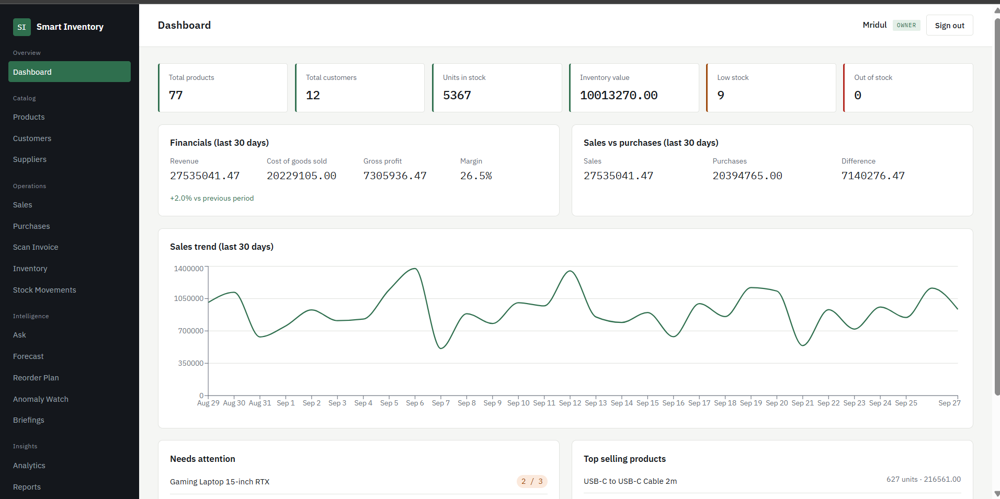

---

## At a glance

| | |
|---|---|
| **What it is** | A full-stack web app for a small shop: inventory, sales, purchasing, analytics, forecasting and AI tools. The live demo is a made-up electronics store. |
| **Stack** | React 19 + Vite on Vercel · Express 5 + Mongoose 9 on Render · MongoDB Atlas · Google Gemini |
| **Size** | 89 REST endpoints · 8 data models · 20 frontend pages · 2 roles with field-level access control |
| **Quality** | **800+ automated tests** in 21 suites (unit tests plus API tests against an in-memory MongoDB), run on every push by GitHub Actions along with frontend lint and build |
| **Forecast accuracy** | Checked on 30 held-out days for all 76 products: mean error **2.17 units/day**, against 2.59 for "tomorrow = today" and 2.50 for "same day last week" *(live figures, recomputed from current data)* |
| **Operations** | Deployed on free tiers. A scheduled GitHub Actions job keeps the demo data current, and the AI spend cap is enforced in code |

---

## Contents

- [Try it in 2 minutes](#try-it-in-2-minutes)
- [The problem](#the-problem)
- [Features](#features)
- [Key technical decisions](#key-technical-decisions)
- [Engineering challenges](#engineering-challenges)
- [Architecture](#architecture)
- [Tech stack](#tech-stack)
- [Project structure](#project-structure)
- [Security](#security)
- [Testing](#testing)
- [Running locally](#running-locally)
- [Deployment](#deployment)
- [Limitations and roadmap](#limitations-and-roadmap)
- [What I learned](#what-i-learned)
- [License](#license)

---

## Try it in 2 minutes

> The API runs on Render's free tier, which sleeps after 15 minutes idle. The first request can take up to a minute; after that the app responds normally.
>
> On the login page, press **Sign in as owner** or **Sign in as employee**. Both are public demo accounts and **read-only**: you can open every page and see live data, but the server refuses anything that would change it. See [Security](#security) for how.

1. **Dashboard:** revenue, cost of goods, margin and a 30-day sales trend.
2. **Forecast:** pick *HDMI Cable 2m*. You'll see the backtest scores, the forecast with a prediction interval, and why the product is marked urgent.
3. **Reorder Plan:** what to order, how much, and the estimated cost, at the service level you choose.
4. **Ask:** type *"Which products made the most profit last month?"* The lookup the model used is shown under the answer.
5. **Scan Invoice:** upload [`samples/sample-supplier-invoice-2.pdf`](samples/sample-supplier-invoice-2.pdf). It is a two-page invoice with an MRP column meant to mislead the reader, product codes, decimal rates and two products that aren't in the catalogue.
6. **Reports:** export any report as CSV, Excel or PDF.

---

## The problem

A small shop, say an electronics store with a few dozen to a few hundred products, usually runs on a stock register, a billing counter and the owner's memory. It breaks down in the same places every time:

| The shop's problem | What this project does about it |
|---|---|
| Reordering by gut feel: popular items run out, slow ones gather dust | Forecasts demand for each product and works out **when** and **how much** to reorder, with a buffer sized to how unpredictable that product is |
| Revenue is visible but profit isn't, so the best seller may barely earn anything | Profit and loss **by product**, ABC analysis, dead stock and turnover reports |
| Staff at the counter can see cost prices and margins | Two roles. Cost fields are **removed from API responses** for employees, and every sensitive action is logged |
| Supplier invoices are retyped line by line | Upload the PDF or a photo. It is read, matched to the catalogue and set up as a purchase to confirm in one click |
| "Smart" tools that make numbers up | An assistant that **only quotes figures the server calculated**, refuses what the user isn't allowed to see, and says so when it can't answer |
| Unusual activity goes unnoticed: a sudden spike, an unusual discount | Anomaly detection with robust statistics, and a weekly briefing in plain language |

---

## Features

### 1. Knowing when to reorder: forecasting and the Reorder Plan

**Problem.** A "keep 30 days of stock" rule treats a cable that sells twenty a day the same as a laptop that sells one a week. It also ignores that some products are far more erratic than others. The result is stock-outs on one shelf and money tied up on another.

**What it does**

- **Picks a forecasting method from the shape of each product's sales history**, rather than always using the most complex one:
  - Products that sell every day use **Holt-Winters** with a damped trend and a weekly pattern.
  - Products that sell on about one day in five (a laptop, a TV) use **Croston's method** with the Syntetos-Boylan correction. A series that is mostly empty days has no weekly pattern to find.
  - Products with under 14 days of history get a plain average, labelled as one.
- **Caps one-off bulk orders before fitting**, so a school buying forty cables doesn't become next month's forecast.
- **Calculates a reorder point** as `μ·L + z·σ·√L`: expected demand over the lead time, plus safety stock sized to how *variable* demand is. It uses each supplier's lead time and ranks products by urgency.

**Why it can be trusted.** Every forecast is backtested. The last 30 days are held out, predicted from the rest, and scored against two free baselines. The page shows the result **including where the baseline wins**. Right now the model wins on 55% of products: 20 of 45 daily sellers and 22 of 31 irregular sellers. Irregular sellers are scored on their total over the window, not day by day. When most days have zero sales, predicting zero every day gives the lowest daily error, and a shop following that forecast would never reorder the laptop.

| Forecast accuracy, published on the page | Forecast with prediction interval |
|---|---|
| 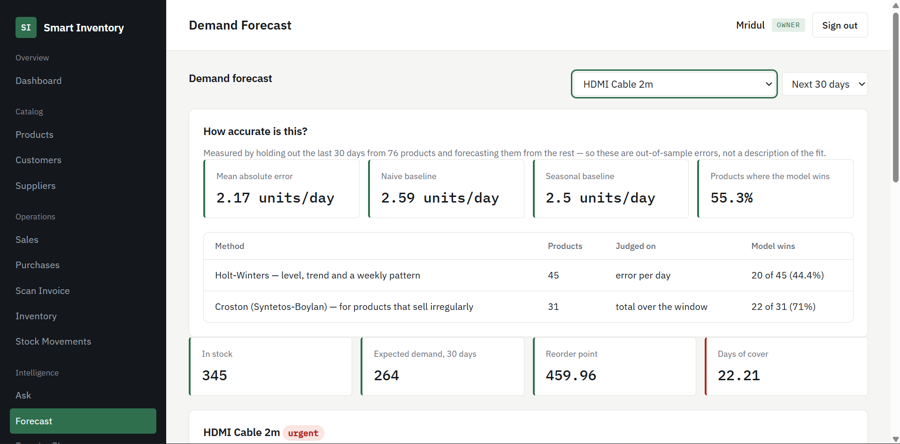 | 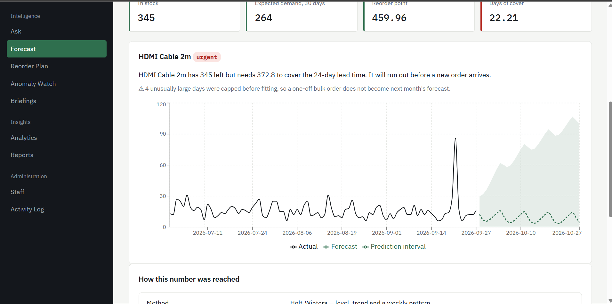 |

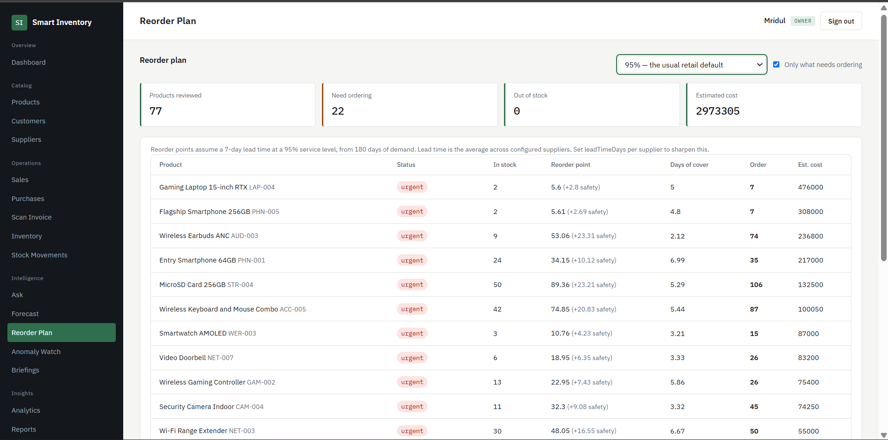

### 2. Knowing what actually makes money: analytics and reports

**Problem.** Revenue is easy to see and misleading. A ₹70,000 television tops the sales chart at a 20% margin, while a ₹450 cable earns more per rupee sold.

**What it does**

- Profit and loss overall, **per product**, and over time
- ABC analysis, inventory turnover, dead stock and stock valuation
- Sales by category, plus customer and supplier performance
- Every report exports as **CSV, Excel or PDF**
- An owner dashboard, and a separate "My Day" view where employees see only their own sales

| Analytics | Reports |
|---|---|
| 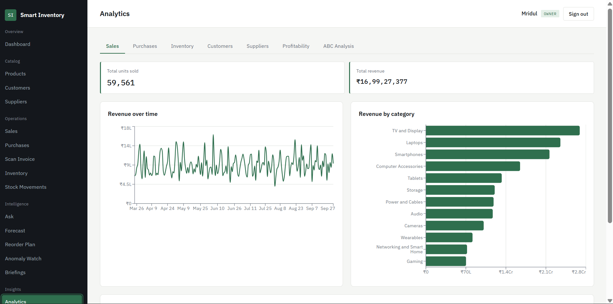 | 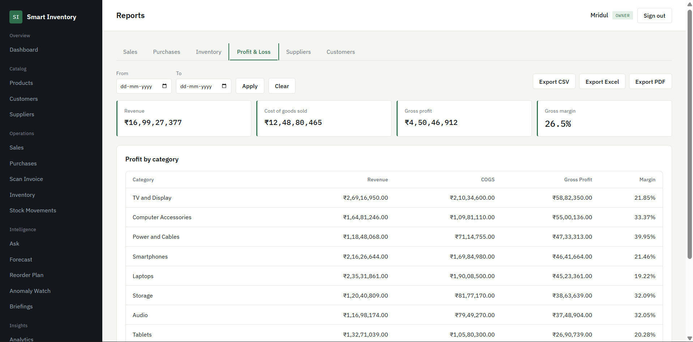 |
| 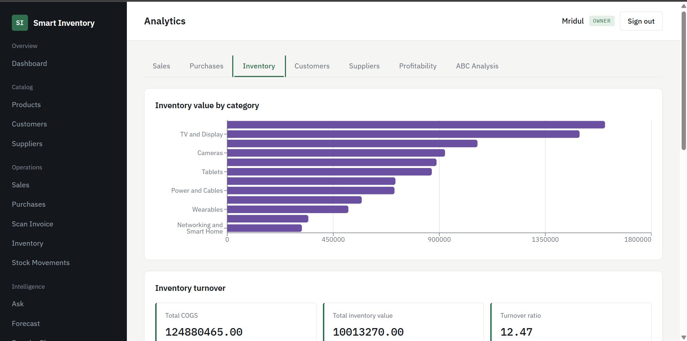 | 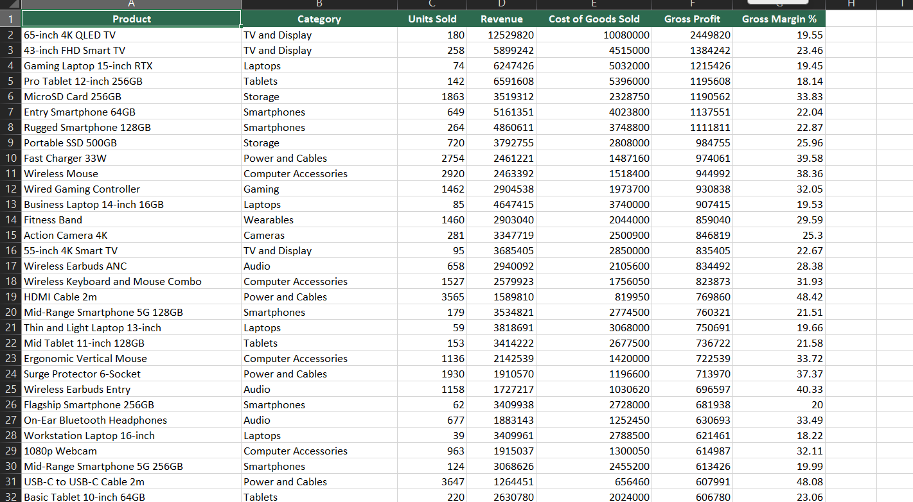 |

### 3. Keeping sensitive figures away from the counter: roles and security

**Problem.** In most small-shop software, everyone logs in as the same user, or an employee login still returns cost prices in the data behind the screen.

**What it does**

- **Two roles, denied by default.** Permissions live in one table. Anything not explicitly granted to employees is refused, so a new endpoint starts out closed.
- **Field-level protection.** Route guards decide which *endpoints* a role can call. A response filter decides which *fields* come back. Employees can list products, but `purchasePrice` and margins are removed from the JSON at any depth, not just hidden in the UI.
- **Sessions done properly.** A 15-minute access token kept only in memory (never `localStorage`), and a rotating `httpOnly` refresh cookie with **reuse detection**. Changing a password or choosing "sign out everywhere" revokes sessions immediately. Passwords are hashed with bcrypt and login is rate-limited.
- **Activity log.** Sign-ins, failed sign-ins, staff changes, sales, purchases, receipts and AI queries are recorded with who did what and when.

| Staff management (emails blurred) | Activity log (emails blurred) |
|---|---|
| 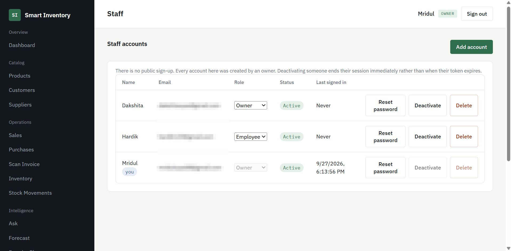 | 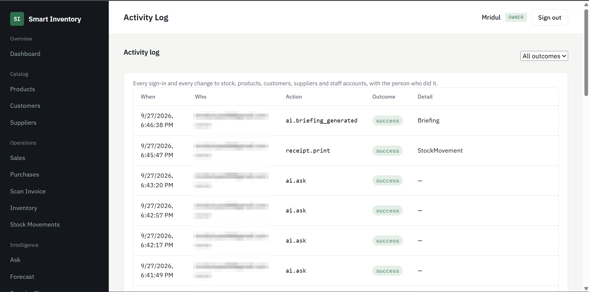 |

### 4. No more retyping supplier invoices: Scan Invoice

**Problem.** Every delivery means copying ten or twenty lines from an invoice by hand. It's slow, and a typo becomes wrong stock.

**What it does**

1. Upload the supplier's **PDF** or a **photo** of a paper invoice.
2. Gemini **only transcribes** it: supplier, invoice number, date, and each line's description, quantity and cost. It doesn't guess.
3. **Ordinary code, not AI,** matches each line to the catalogue and marks it *matched*, *check this* or *unrecognised*.
   - It understands how suppliers write things: `20000 MAH`, `2 MTR`, `WIFI`, `PEN DRIVE`.
   - Numbers must match exactly, so a 10,000 mAh power bank is never mistaken for a 20,000 mAh one.
   - When an invoice leaves out a size, it asks instead of guessing.
4. An unrecognised line can be **added to the catalogue from the same screen**. The name is tidied, the cost comes from the invoice, a SKU and low-stock level are suggested, and the owner sets the selling price.
5. Nothing changes stock until the owner presses **Record**.

With product names written the way suppliers print them, the matcher recognises all 76 catalogue products. Before it was taught electronics units and spellings, it recognised 17.

| Header read from a two-page PDF | Each line matched, flagged or offered as a new product |
|---|---|
| 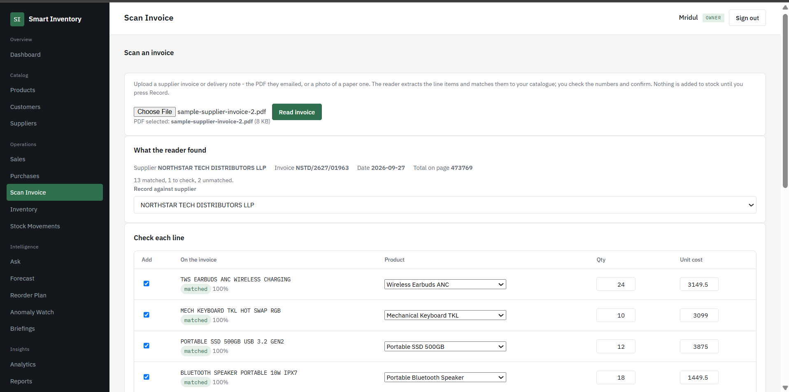 | 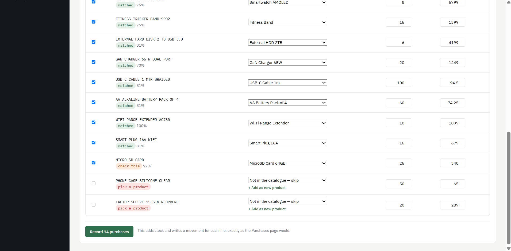 |

### 5. Answers instead of dashboards: Ask

**Problem.** The owner wants to know "which products made the most profit last month?", not which of eleven report pages has the answer. But a chatbot that invents a plausible number is worse than no answer at all.

**What it does.** You ask in plain English. The model chooses from **13 read-only lookups**, the server runs them, and the model writes the answer. The lookups used are shown under every answer.

**Why it can be trusted**

- **The model writes the language; the server calculates the numbers.** It never writes a database query and never produces a figure itself.
- **It is refused the way a person would be.** Each lookup's permission is checked against the *signed-in user's* role before any data is read. An employee asking about margins is stopped by the authorisation layer, not by a line in a prompt. Employees get 2 of the 13 lookups.
- **It explains its own failures** to the owner: a rejected key, used-up quota, a retired model, a slow response, or Google being overloaded.

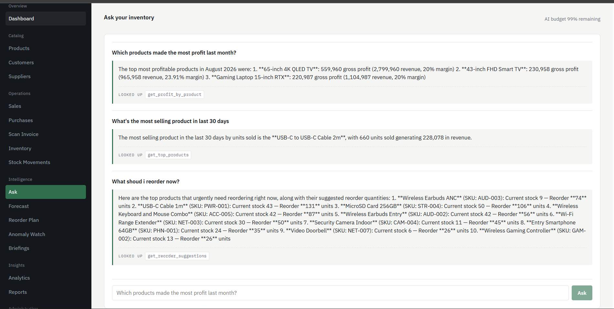

### 6. Noticing what nobody was watching: Anomaly Watch, Briefings and receipts

- **Anomaly Watch** flags unusual sales volume, unusual discounts and staff outliers. It uses the median and median absolute deviation, so one extreme value can't hide itself by stretching the measure it's judged against.
- **Weekly briefings** summarise the week in plain language. The figures are calculated first and the model only narrates them. If the model is unavailable, the briefing is written from a template.
- **Receipts:** a PDF receipt for any sale.

<details>
<summary><b>More screenshots:</b> sales, purchases, stock ledger, receipt, purchase analytics</summary>

| | |
|---|---|
| 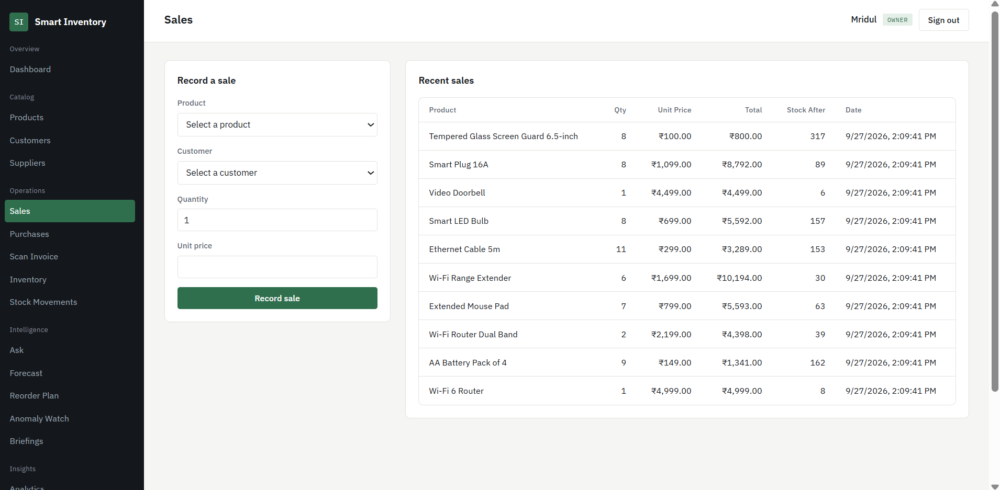 | 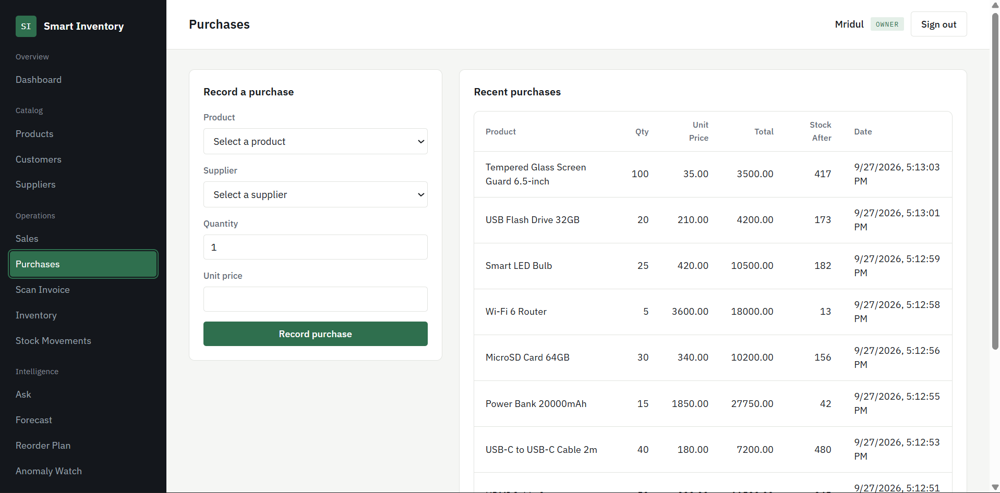 |
| 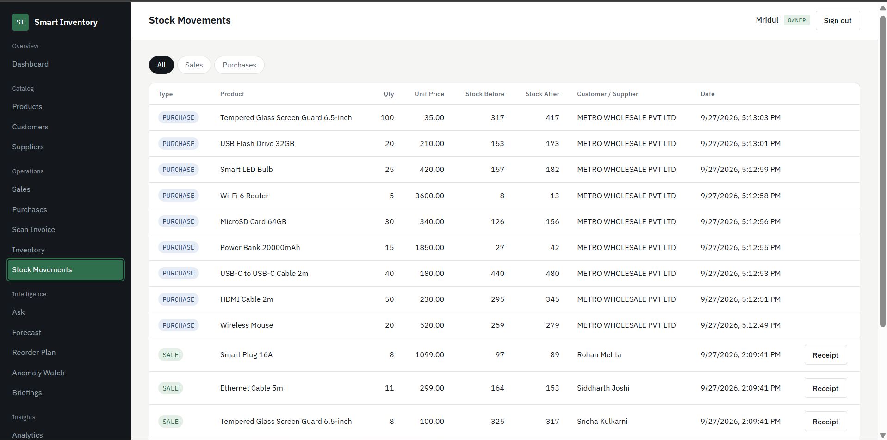 | 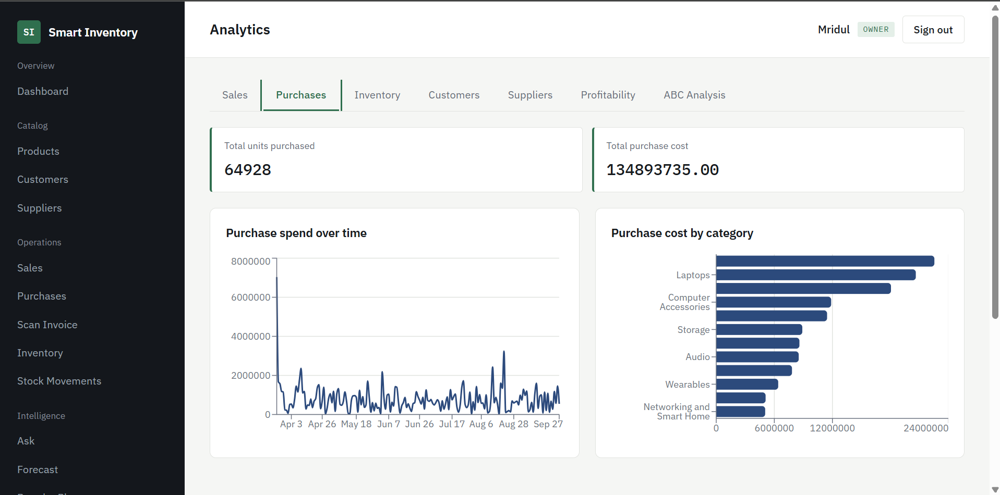 |


</details>

### Works without AI, and can't run up a bill

Every AI call goes through one client with a timeout, a single retry, a response cache, a usage log and a monthly spend cap (default $5). With no API key the app still works: the assistant says it isn't set up, anomalies show their numbers without commentary, and briefings use the template. The model name is a setting (`GEMINI_MODEL`), so when Google retires a model, switching is a configuration change, not a code change.

---

## Key technical decisions

| Decision | Why | Trade-off accepted |
|---|---|---|
| **Classical statistics for forecasting** (Holt-Winters, Croston) instead of an ML model or an LLM | Six months of daily sales per product is too little for ML to beat these methods. They're explainable, run in milliseconds, and can be backtested honestly | They can't see outside factors such as festivals, promotions or price changes |
| **The LLM writes language only; every number comes from a server-side lookup** | A made-up figure in a business tool is worse than no answer. The lookups reuse the same permission checks as the REST API | Questions outside the 13 lookups get "I can't answer that" rather than a best guess |
| **Public demo logins that are read-only on the server** | The demo password is published, so anyone can sign in, including someone who wants to script a million fake sales. The check sits in the auth middleware every route passes through, and allows reads by default and nothing else | Visitors can't try recording a sale; Ask and Scan Invoice are allowed but capped per visitor, per day and as a share of the AI budget |
| **Invoice matching done by rules, not AI** | Deterministic, testable (every product tested under three spellings), free and instant. The AI is used only for reading the document, where it's actually needed | New kinds of supplier wording need a rule, not just a prompt |
| **Access token in memory + rotating `httpOnly` refresh cookie** | Script injection (XSS) can't steal a long-lived credential, and a stolen refresh token is caught the moment it's reused | Needs a same-origin proxy (Vercel rewrite) so the cookie stays first-party, and a silent refresh on every page load |
| **Deny-by-default permission table + response field filter** | Access rules live in one place instead of `if (role === ...)` scattered through controllers. Cost prices can't leak through a new endpoint someone forgets to guard | Every new endpoint must be added to the table before anyone can use it |
| **MongoDB transactions for every stock change** | A sale and its stock update succeed or fail together, so the running ledger always adds up | MongoDB must run as a replica set, even locally |
| **Deterministic, seeded demo-data generator** | Every run produces the same shop, so screenshots, tests and bug reports stay reproducible | More code than inserting random rows |
| **Free-tier hosting, with GitHub Actions as the scheduler** | No running cost for a portfolio project, and a Render cron job would cost money | Cold starts on the first request after the API has been idle |

---

## Engineering challenges

Some of the more instructive bugs. Each is now covered by a regression test.

- **The backtest was cheating.** The "same day last week" baseline read past the training window into the very days it was meant to predict. That made the real model look worse than it was. The baseline now repeats only the last full week of training data.
- **A date bug that only happened east of Greenwich.** Days were built with local-time `setHours` and keyed with UTC `toISOString`, so every date slipped back a day in India but not in CI. The test suite now runs in `Asia/Kolkata` on purpose.
- **Counting a product's pre-launch days as "no sales".** Padding the history window with zeros made a product that sells every day look irregular, so it got the wrong forecasting method. The test that caught it only checked a method name.
- **One environment variable, two production bugs.** A backend URL baked into the frontend build sent requests to a different origin. The refresh cookie was dropped, so users were logged out on every reload, and preview deployments were blocked by CORS. Production builds now always go through the same-origin proxy.
- **"Lead time" that was really order frequency.** The Forecast page estimated a supplier's lead time from the gap between deliveries. That gap is how often the shop reorders, not how long an order takes to arrive, so a cable restocked every three weeks got a 24-day lead time while the Reorder Plan used 7. The same product was "urgent" on one page and fine on the other. Lead time now comes from the supplier who delivers the product, and the Reorder Plan, the Forecast page, the assistant and the weekly briefing all build the plan from one shared function.
- **A shared login that could sign everyone out.** Each account keeps at most five sessions. On a demo login shared by many visitors, the sixth sign-in pushed out the first visitor's session. That visitor's next token refresh then looked like a stolen token being replayed, and reuse detection revoked every session on the account. Demo accounts now skip the session list: their tokens are still signed, expire and can be revoked, but they aren't tracked one by one.
- **A dropdown that lied.** A page asked for 200 products from an API that caps requests at 100. The request failed silently, so every invoice line showed "skip" while a real match sat underneath. Pressing Record would have added stock the screen said it was skipping.

---

## Architecture

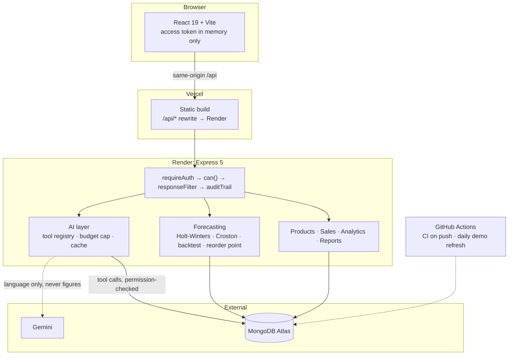
```mermaid
flowchart TB
    subgraph Browser
        UI["React 19 + Vite<br/>access token in memory only"]
    end

    subgraph Vercel
        CDN["Static build<br/>/api/* rewrite → Render"]
    end

    subgraph Render["Render: Express 5"]
        MW["requireAuth → can() → responseFilter → auditTrail"]
        API["Products · Sales · Analytics · Reports"]
        FC["Forecasting<br/>Holt-Winters · Croston · backtest · reorder point"]
        AI["AI layer<br/>tool registry · budget cap · cache"]
    end

    subgraph External
        DB[("MongoDB Atlas")]
        GEM["Gemini"]
    end

    GHA["GitHub Actions<br/>CI on push · daily demo refresh"]

    UI -->|"same-origin /api"| CDN
    CDN --> MW
    MW --> API
    MW --> FC
    MW --> AI
    API --> DB
    FC --> DB
    AI -->|"tool calls, permission-checked"| DB
    AI -.->|"language only, never figures"| GEM
    GHA -.-> DB
```

The dotted line to Gemini is the important one: Gemini writes sentences, and every number in the app is calculated in JavaScript.

---

## Tech stack

| Layer | Technology |
|---|---|
| Frontend | React 19, Vite, React Router 7, Recharts, Axios |
| Backend | Node 22, Express 5, Mongoose 9, envalid (validated config), winston + morgan (logging) |
| Database | MongoDB Atlas, with aggregation pipelines for analytics and multi-document transactions for stock changes |
| Security | JWT (access + rotating refresh), bcrypt, helmet, express-rate-limit, Mongo operator sanitising, CORS set to one exact origin |
| AI | Google Gemini via `@google/genai`: function calling, structured output, PDF and image input |
| Files | multer (uploads), pdfkit (receipts, PDF reports), exceljs, json2csv |
| Testing | Jest, Supertest, mongodb-memory-server |
| DevOps | GitHub Actions (CI + scheduled job), Render (API), Vercel (frontend) |

---

## Project structure

```
├── app.js, server.js          Express app and entry point
├── config/                    Env validation, database connection
├── routes/                    12 routers, 89 endpoints
├── middlewares/               auth, permissions, responseFilter, auditTrail, errorHandler
├── controllers/               Thin HTTP layer
├── services/
│   ├── forecasting/           Holt-Winters, Croston, backtest, reorder maths
│   ├── anomaly/               Median/MAD detectors
│   ├── ai/                    Gemini client, 13 permission-checked tools, invoice reader + matcher
│   ├── inventory/             Stock changes inside transactions
│   └── seed/                  Deterministic demo-data generator, gap filler
├── models/                    Product, StockMovement, Customer, Supplier, User, AuditLog, AiCall, Briefing
├── tests/                     21 suites, 800+ tests
├── frontend/src/
│   ├── pages/                 One file per screen
│   ├── context/               Auth provider (silent refresh, retries)
│   └── api/                   Axios client and endpoint wrappers
├── samples/                   Sample supplier invoices for Scan Invoice
└── .github/workflows/         ci.yml, demo-catchup.yml
```

Every endpoint is documented in [API_REFERENCE.md](API_REFERENCE.md), and each authentication decision is explained in [AUTHENTICATION.md](AUTHENTICATION.md).

---

## Security

- There is no public sign-up. The first owner comes from environment variables; every other account is created by an owner.
- The server **refuses to start** in production without two different, strong JWT secrets.
- Rate limits: login 8 attempts per 15 minutes, Ask 10 questions per minute, and an overall ceiling for the whole API.
- Passwords are hashed with bcrypt, and changing one revokes every session for that user immediately.
- Keys starting with `$` or containing `.` are stripped from all input to block MongoDB operator injection. `helmet` sets the security headers.
- Cost fields are removed from responses for employees at any depth. This is tested, not just hidden in the UI.
- **Public demo accounts are read-only on the server.** Every request from a demo account that could change data gets a 403 before it reaches a controller, including endpoints added later, because the check allows only reads. Other people's email addresses, IP addresses and browsers are masked in what a demo account sees. AI use is capped per visitor per day, per demo account per day (counted in the database, so a restart doesn't reset it) and at half the monthly AI budget. All sign-ins are limited to 30 per hour per address.
- Secrets live only in the hosting dashboards. CI never gets the JWT secrets, and the demo-refresh job refuses to run unless the database is marked `DEMO_MODE=true`.

---

## Testing

```bash
npm test
```

| Suite | Covers | Needs a database |
|---|---|---|
| `authorization.unit.test.js` | Permission table, cost-field filter, token signing | no |
| `forecasting.unit.test.js` | Holt-Winters, Croston, spike capping, backtest, reorder maths, anomaly detectors | no |
| `ai.unit.test.js`, `aiClient.unit.test.js` | Lookup permissions, refusals, failure diagnosis, what is sent to the model | no |
| `invoiceMatcher.unit.test.js` | Supplier wording, exact numbers, every catalogue product under three spellings | no |
| `demo.unit.test.js` | Demo accounts: writes refused, private fields masked, AI allowance | no |
| `catchup.unit.test.js` | Gap detection, ledger consistency, safe reruns | no |
| `auth.test.js` | Login, cookie flags, rotation, reuse detection, revocation | yes |
| `rbac.test.js` | 401s, 403s, cost stripping, movement scoping, audit entries | yes |
| `aiFeatures.test.js` | Forecast, reorder, anomalies, briefings, receipts, invoice upload, profit by product | yes |
| 11 further suites | Products, sales, purchases, analytics, reports and exports | yes |

The code that decides access and calculates the figures people act on is tested without a database, so a mistake in the permission table or the reorder maths fails in under a second. A few tests also work as documentation:

- `forecasting.unit.test.js` checks that safety stock grows with `√L`, not `L`. Getting that wrong roughly doubles the money tied up in stock at a 7-day lead time.
- `ai.unit.test.js` proves the assistant's permission check runs *before* any database access. That suite has no database, so a refusal that came after the query would hang instead of passing.
- `aiFeatures.test.js` sets up a product with more revenue but far less profit, and checks that the profit ranking isn't fooled by it.

---

## Running locally

**Prerequisites:** Node 20+, and MongoDB running as a single-node replica set (sales and purchases run inside transactions, which a standalone `mongod` rejects).

```bash
mongod --replSet rs0 --dbpath <your-db-path>
mongosh --eval "rs.initiate()"
```

```bash
git clone https://github.com/knightowl146/Smart-Inventory-And-Sales-Management-System.git
cd Smart-Inventory-And-Sales-Management-System
npm install
cp .env.example .env          # then fill it in, see below

node -e "console.log(require('crypto').randomBytes(48).toString('base64url'))"
# run twice → JWT_ACCESS_SECRET and JWT_REFRESH_SECRET

npm run seed                  # electronics catalogue (asks before wiping products + movements)
npm run seed:owner            # the first owner account
npm run seed:history          # 180 days of trading history
npm run dev                   # API on :3000

cd frontend && npm install && npm run dev   # :5173, proxying /api to :3000
```

| Variable | Required | Notes |
|---|---|---|
| `MONGO_URI` | yes | Include the database name. Needs `?replicaSet=rs0` locally |
| `JWT_ACCESS_SECRET` / `JWT_REFRESH_SECRET` | yes in production | Two different strong values; the server won't start without them |
| `CORS_ORIGIN` | production | The frontend's URL, exactly |
| `GEMINI_API_KEY` | no | Every AI feature keeps working in a reduced form without it |
| `GEMINI_MODEL` | no | Default `gemini-3.8-flash` |
| `AI_MONTHLY_BUDGET_USD` | no | Spend cap, default $5 |
| `OWNER_EMAIL` / `OWNER_PASSWORD` | for seeding | Read only by `npm run seed:owner` |

<details>
<summary>All scripts</summary>

| Command | Does |
|---|---|
| `npm run dev` | API with auto-reload |
| `npm test` | The full test suite |
| `npm run seed` | Electronics catalogue: deletes existing products and movements, after asking |
| `npm run seed:owner` | First owner account |
| `npm run seed:demo-users` | Read-only demo accounts from `DEMO_OWNER_EMAIL` / `DEMO_OWNER_PASSWORD` (and the `DEMO_EMPLOYEE_` pair), added next to the real ones |
| `npm run seed:history` | Backdated trading history (`-- --days=365`, `-- --fresh`) |
| `npm run seed:catchup` | Fill days with no trading up to yesterday (`-- --dry-run` to preview, `-- --today` to include today so far) |
| `npm run briefing` | Generate a weekly briefing |
| `npm run reset:demo` | Rebuild the demo database (only runs with `DEMO_MODE=true`) |

</details>

---

## Deployment

- **Backend → Render** (`render.yaml`). Set `MONGO_URI`, `JWT_ACCESS_SECRET`, `JWT_REFRESH_SECRET`, `CORS_ORIGIN`, and optionally `GEMINI_API_KEY` and `GEMINI_MODEL`.
- **Frontend → Vercel**, with `frontend` as the root directory. `frontend/vercel.json` rewrites `/api/*` to the Render service, which keeps the browser on one origin so the refresh cookie stays first-party. Setting `VITE_DEMO_OWNER` and `VITE_DEMO_EMPLOYEE` (as `email / password`) adds one-click demo sign-in buttons to the login page. Create those accounts first with `npm run seed:demo-users`, using the same values.
- **Daily demo refresh.** With a repository secret `SEED_MONGO_URI`, the `demo-catchup` workflow fills any days the demo sat unused, every morning at 05:45 IST. Each product continues its own sales pattern, so the charts never drop off a cliff.

Lessons that each cost an afternoon:

- `vercel.json` rejects unknown keys, including `//` comments, and fails the build before it starts.
- `CORS_ORIGIN` must match the Vercel URL exactly, with no trailing slash.
- A `MONGO_URI` without a database name connects to one called `test`, and the app runs perfectly against an empty database.
- Render's build uses `npm ci`, which fails if `package-lock.json` is out of sync with `package.json`.

---

## Limitations and roadmap

Known limitations:

- Profit uses each product's **current** purchase price. Costing each sale at the price of the batch it came from (FIFO) is next.
- Forecasts use sales history only; festivals, promotions and price changes aren't modelled.
- The API is a single free-tier instance. For real traffic, the next steps would be a paid always-on instance, compound indexes on stock movements by product and date, and caching the heavier analytics queries.
- The Ask assistant only covers what its 13 lookups can answer.

Next steps:

- A shared data-loading hook to replace per-page loading code in the frontend.
- Showing today as "so far" on trend charts.
- Batch (FIFO) costing, as above.

---

## What I learned

- **Measure before you claim.** Publishing the backtest, including where the simple baseline wins, did more for the forecasting feature than making the model more complex.
- **Put LLMs where they're strong.** Reading a messy PDF is a great use of an LLM. Calculating profit isn't. Keeping the model to language made the AI features testable and trustworthy.
- **Security lives in the data layer.** Hiding a column in the UI protects nothing; removing it from the response does.
- **Production is a different environment.** Cookies, CORS, time zones, lockfiles and free-tier sleep each caused a bug that never showed up locally.

---

## License

[MIT](LICENSE)

---

<div align="center">

Built by **Mridul Vyas** · [GitHub](https://github.com/knightowl146)

</div>
